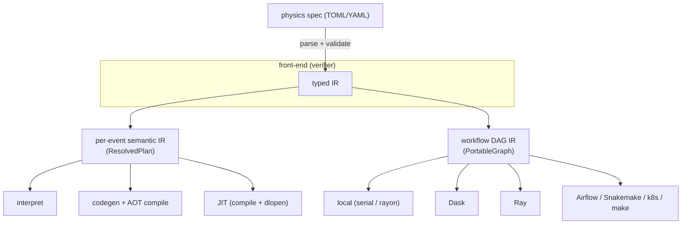

# nano.rust as a two-level compiler: one verifier, many back-ends

The pieces in this repo are not an ad-hoc pile of crates — they form the classic
**compiler shape**: a *front-end* that verifies meaning into a typed
intermediate representation (IR), and interchangeable *back-ends* that execute
that IR. Stated once, here, because it is currently only implicit across
`vision.md`, `semantic-layer.md`, `state-machine.md`, and `orchestrator.md`.

## The shape

**One front-end, two IRs, many back-ends per IR.** The physicist writes the
spec; the verifier (`nano-spec`) turns it into a typed IR; everything below
chooses *how* to run, never *what* the physics is.

## The front-end (verifier): spec → typed IR

`nano-spec`: parse a spec → `AnalysisSpec` → `validate(spec, catalogue)` →
`ResolvedPlan`. Validation is the hard gate — every branch exists with the right
type for the era, units are present, objects/regions are defined, model outputs
are produced before use. The output is a *typed IR*, not text. This is the only
place physics meaning is decided.

## Two IRs, same pattern

The split the user-facing model often misses: there are **two** levels, each a
verified IR with pluggable back-ends.

### 1. Per-event semantic IR — what the kernel does to one event

`ResolvedPlan` (objects, cuts, regions, outputs, models). Back-ends:

| Back-end | What it is | Guarantee from | Status |
|---|---|---|---|
| **interpret** | walk the IR per event (`nano-spec::interpret`) | the spec *validator* | building |
| **codegen + AOT** | IR → generated Rust (`nano-analysis` typestate) → compiled kernel | the **Rust compiler** | built |
| **JIT (compile + dlopen)** | IR → Rust → `rustc` at runtime → `libloading` | the **Rust compiler** | future |
| ~~Cranelift / LLVM JIT~~ | lower IR to a codegen backend ourselves | nothing reusable — rejected | — |

The compiled kernel is expressed *in the `nano-analysis` typestate* — `Raw →
Baseline → Scored<M> → Region → Weighted<R> → fill` — so stage order, region
typing, weight-before-fill, units, and exhaustive systematics are all
compiler-checked. The interpreter trades that for not needing a toolchain.

### 2. Workflow DAG IR — how the kernel runs across files

`PortableGraph` (source/chunk → map → reduce → sink), with typed node states
(merge-before-map is unconstructable) and provenance/staleness. Back-ends:

| Back-end | What it is | Status |
|---|---|---|
| **local** | in-process serial / rayon-parallel, serial==parallel asserted | built |
| **Dask / Ray** | thin adapters submit the `run-chunk`/`merge` task unit | built (adapters) |
| **anything** | JSON graph + a CLI task atom → Airflow, Snakemake, k8s, `make` | open by design |

## The distinctive property

In a normal "verify, then interpret bytecode" stack, the verifier and the
executor are separate mechanisms. Here, **some back-ends route execution back
through `rustc`** (codegen + AOT, and JIT): the executor *is* the verifier. The
correctness guarantee and the execution are the same mechanism — which is the
whole reason the project is in Rust, and why "if it compiles, it's safe to
parallelize" is a property of the *executor*, not a separate proof.

The **interpreter** is the one back-end that does not get the compiler guarantee
— it relies on the spec validator instead. That is exactly why the compiled /
JIT paths remain the trusted *production* back-ends, while the interpreter is the
*flexible* one (arbitrary validated spec, no toolchain, slightly slower).

## "Verify *what* once; choose *how*"

Because the IR is the contract and back-ends are interchangeable, the same
verified analysis runs:

- event-at-a-time (interpret) for exploration,
- compiled + chunk-parallel for production,
- distributed over Dask/Ray for scale,

…all from one spec, each correct by construction (compiled paths) or by
validation (interpreted path). You verify the physics once; the framework picks
the execution.

## Crate map

| Layer | Crate(s) |
|---|---|
| Front-end (verifier) | `nano-spec` (parse/validate/derive), `nano-corrections` (typed corrections) |
| Per-event IR + kernel vocabulary | `nano-spec` (IR), `nano-analysis` (typestate), `nano-inference` (model boundary) |
| Per-event back-ends | `nano-spec::interpret`; codegen → `nano-producers`-shaped kernels; (JIT: future) |
| Data plane | `nano-rootio` (owned ROOT I/O), `nano-io` (streaming), `nano-core` (event model) |
| Workflow IR + back-ends | `nano-workflow` (DAG, local executor, portable graph, task unit), `integrations/` (Dask/Ray) |
| Action space | `nano-cli` (`validate`/`branches`/`inspect`/`codegen`/`run`), `nano-mcp` (same as agent tools) |
