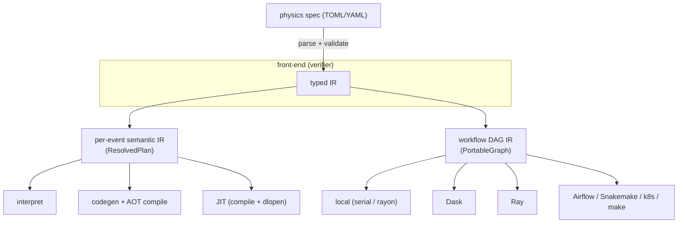

# nano.rust as a two-level compiler: one verifier, many back-ends

The pieces in this repo are not an ad-hoc pile of crates — they form the classic
**compiler shape**: a *front-end* that verifies meaning into a typed
intermediate representation (IR), and interchangeable *back-ends* that execute
that IR. Stated once, here, because it is currently only implicit across
`vision.md`, `semantic-layer.md`, `state-machine.md`, and `orchestrator.md`.

## The shape



**One front-end, two IRs, many back-ends per IR.** The physicist writes the
spec; the verifier (`nano-spec`) turns it into a typed IR; everything below
chooses *how* to run, never *what* the physics is.

## The front-end (verifier): spec → typed IR

`nano-spec`: parse a spec → `AnalysisSpec` → `validate(spec, catalogue)` →
`ResolvedPlan`. Validation is the hard gate — every branch exists with the right
type for the era, units are present, objects/regions are defined, model outputs
are produced before use. The output is a *typed IR*, not text. This is the only
place physics meaning is decided.

## Two IRs, same pattern

The split the user-facing model often misses: there are **two** levels, each a
verified IR with pluggable back-ends.

### 1. Per-event semantic IR — what the kernel does to one event

The per-event path is itself a small multi-stage compiler:

```
Surface spec (TOML/YAML)  →  Core IR  →  KIR (Kernel IR)  →  { interpret | codegen }
   AnalysisSpec              typed       single executable
   (validate)                Effect/      semantics
                             Type/        (both back-ends
                             primitive    derive from KIR)
                             registry
```

`validate(spec, catalogue)` lowers the surface spec into a typed **Core IR**
(`nano-spec::core`: an `ExprNode` arena with a `Type`/`Effect` lattice and a
`PrimitiveSpec` registry — new physics functions are *registered*, not
hand-branched) and derives `read_branches` from the Core IR's `ReadsBranch`
effects. Core IR lowers to **KIR** (`nano-spec::kir`: a typed `KirProgram` of
`Block`/`Stmt`/`Rvalue`, with a `verify()` pass). KIR is the **single
executable semantics**: the interpreter *executes* KIR and codegen *emits* from
KIR, so interpreter/codegen drift is eliminated by construction, not just by
test. `ResolvedPlan` remains the validated handle the back-ends consume.

| Back-end | What it is | Guarantee from | Status |
|---|---|---|---|
| **interpret** | execute the verified KIR per event (`nano-spec::interpret`, `nano run --interpret`) | the spec *validator* | built |
| **codegen + AOT** | KIR → generated Rust (`nano-analysis` typestate) → compiled kernel | the **Rust compiler** | built |
| **JIT (compile + dlopen)** | KIR → Rust → `rustc` at runtime → dynamic loader | the **Rust compiler** | first muon slice, optional |
| ~~Cranelift / LLVM JIT~~ | lower IR to a codegen backend ourselves | nothing reusable — rejected | — |

The compiled kernel is expressed *in the `nano-analysis` typestate* — `Raw →
Baseline → Scored<M> → Region → Weighted<R, S> → fill`. The typestate *makes
invalid states unrepresentable* for code written in it (stage order, region
typing, score-before-use, weight-before-fill, units, exhaustive systematics).
The weighted state carries **both** a region marker `R` and a systematic-axis
marker `S` (`Weighted<R, S>`): each generated analysis owns a closed
`Systematic` enum and `SystematicVisitor`, so adding a declared variation
forces every generated consumer to handle it or fail to compile (a
`compile_fail` doctest proves an incomplete generated visitor is rejected).
Generated row-only kernels exercise region gating and, for
`[[model]]` specs, `Ev::infer`/`score`; generated histogram kernels emit
`EventWeight -> Weighted<R, Nominal> -> fill` and route the weight through an
emitted `impl SystematicVisitor` (`systematic.visit(...)`). Multi-variation
histogram fan-out (KIR `ForEach`/`Fill`) uses those per-analysis enum variants;
a `Quantity<Dim>` unit lattice is still an in-progress sub-move. `Unit` is
currently `GeV`/dimensionless. The interpreter
trades the compiler guarantee for not needing a toolchain.

### 2. Workflow DAG IR — how the kernel runs across files

`PortableGraph` (source/chunk → map → reduce → sink), with typed node states
(merge-before-map is unconstructable) and provenance/staleness. Back-ends:

| Back-end | What it is | Status |
|---|---|---|
| **local** | in-process serial / rayon-parallel, serial==parallel asserted | built |
| **Dask / Ray** | thin adapters submit the `run-chunk`/`merge` task unit | built (adapters) |
| **anything** | JSON graph + a CLI task atom → Airflow, Snakemake, k8s, `make` | open by design |

## The distinctive property

Correctness here is enforced by **two verifiers that compose** — not by rustc
alone:

1. **The front-end validator** (`nano-spec::validate`) checks *domain facts* rustc
   can't know: the branch exists for the era with the right type, units are
   present, objects/regions are defined, a model output is produced before use.
2. **rustc** checks the *structure of the generated Rust*: because the codegen
   target is the `nano-analysis` typestate, stage/region/weight-before-fill/score-
   before-use/exhaustive-systematic violations are compile errors, and a kernel
   with no shared mutable state is safe to parallelize.

The distinctive bit vs a normal "verify, then interpret bytecode" stack: for the
**compiled / JIT** back-ends the second verifier *is the compiler that also
produces the executable* — so those structural guarantees and the execution are
the same mechanism (this is why "if it compiles, it's safe to parallelize" is a
property of the executor). Branch existence etc. remain the *validator's* job,
not rustc's — don't conflate the two.

The **interpreter** is the one back-end that does not get the compiler guarantee
— it relies on the spec validator instead. That is exactly why the compiled /
JIT paths remain the trusted *production* back-ends, while the interpreter is the
*flexible* one (arbitrary validated spec, no toolchain, slightly slower).

The JIT back-end lives in `nano-jit` behind the `jit` feature. It is deliberately
optional: it needs a Rust toolchain at runtime and pays compile latency before
the first event. Its purpose is arbitrary validated specs at native speed without
a manual rebuild, not replacing the default interpreter or AOT paths. The first
slice exports a C ABI muon kernel (`nMuon`, `Muon_pt`, `Muon_eta`, and a
`repr(C)` row) so `&nano_core::Event` never crosses the dynamic-library boundary;
the loaded crate reconstructs its own internal event and calls the generated
producer inside the dylib.

## "Verify *what* once; choose *how*"

Because the IR is the contract and back-ends are interchangeable, the same
verified analysis runs:

- event-at-a-time (interpret) for exploration,
- compiled + chunk-parallel for production,
- distributed over Dask/Ray for scale,

…all from one spec, each correct by construction (compiled paths) or by
validation (interpreted path). You verify the physics once; the framework picks
the execution.

## Crate map

| Layer | Crate(s) |
|---|---|
| Front-end (verifier) | `nano-spec` (parse/validate/derive; `[[correction]]` scale_factor + jes, `[lumi_mask]`, triggers/flags), `nano-corrections` (native correctionlib-v2 evaluator, wired into the spec) |
| Per-event IR + kernel vocabulary | `nano-spec::core` (typed Core IR + primitive registry), `nano-spec::kir` (KIR, single executable semantics), `nano-analysis` (`Weighted<R,S>` typestate), `nano-inference` (model boundary) |
| Per-event back-ends | `nano-spec::interpret` (executes KIR); codegen (emits from KIR) → `nano-producers`-shaped kernels; `nano-jit` (optional runtime compile + dlopen) |
| Data plane | `nano-rootio` (owned ROOT I/O — reads NanoAOD v9/v12/v15, writes TTrees + `TH1F`), `nano-io` (streaming, `samples` table + normalization, `datacard` emitter), `nano-core` (event model) |
| Output / statistics handoff | `nano-io::datacard` (multi-process Combine datacard + `shapes.root`), `nano-io::samples` (sample table, per-sample xsec·lumi/sumw normalization), `nano-validate` (golden compare incl. the frozen v9/v12/v15 references) |
| Workflow IR + back-ends | `nano-workflow` (DAG, local executor, portable graph, task unit; multi-chunk == single-pass), `integrations/` (Dask/Ray) |
| Action space | `nano-cli` (`validate`/`branches`/`inspect`/`codegen`/`run`/`certify`/`compare`), `nano-mcp` (same as agent tools) |
| Worked example | `crates/nano-io/examples/full_analysis_workflow.rs` + [`worked-example.md`](worked-example.md) — samples → corrections+systematics spec → multi-process datacard, end to end |
