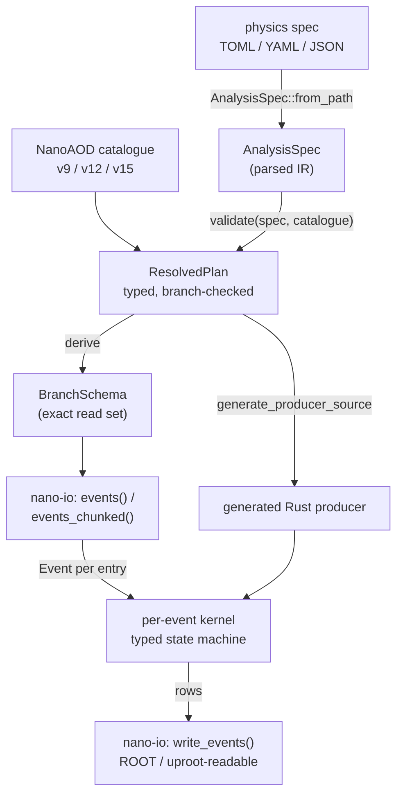
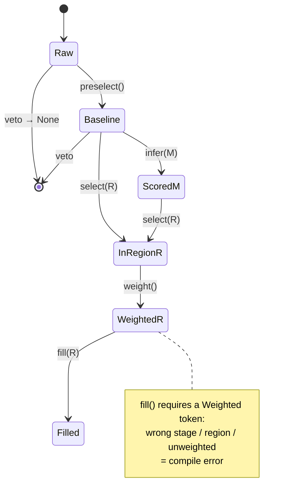
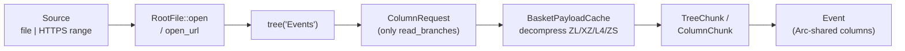
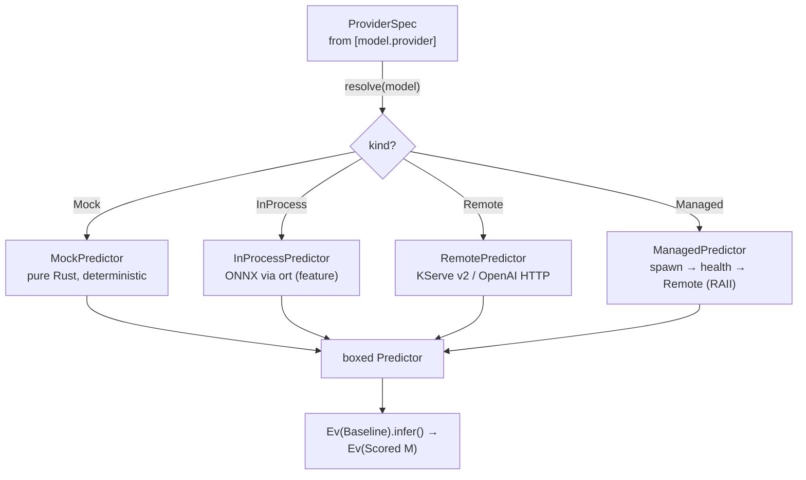
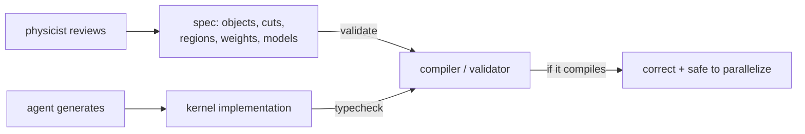

# A schematic tour of the nano.rust API, layer by layer

*2026-06-22 — how the pieces fit: the data flow from a physics spec to written
ROOT, the typed event life cycle, read-on-demand I/O, and the inference
protocol — with the actual public APIs and a diagram per layer.*

The other notes argue *why* (hard constraints) and show *that it runs* (the
screencasts). This one is the map: the public types of each crate and how an
event flows through them. Every signature below is the real one.

## The whole pipeline

A physics spec is parsed to an IR, validated against a NanoAOD catalogue into a
typed plan, and that plan drives *both* the reader (which branches to bind) and
the generated kernel (the event loop). The reader produces `Event`s; the kernel
turns them into rows; the writer emits ROOT.



The arrows are the API. `nano_spec::AnalysisSpec::from_path` →
`nano_spec::validate(&spec, &catalogue) -> ResolvedPlan` →
`nano_spec::codegen::generate_producer_source(&plan) -> String`. The reader entry
points are `nano_io::events(path, &schema)` and the bounded-memory
`events_chunked(...)`; output is `nano_io::write_events(path, &[OutputBranch])`.

## Layer 1 — dynamic data access (`nano-core`)

The reader hands you an `Event`. Branch access is runtime-typed and follows the
`Prefix_attr` grouping rule: a vector branch `Muon_pt` becomes object `Muon`,
attribute `pt`; a scalar like `MET_pt` stays event-level.

```rust
let muons = event.collection("Muon")?;          // -> Collection
for m in muons.iter() {                          // -> ObjectView
    let pt  = m.get::<f32>("pt")?;               // attribute read
    let eta = m.get::<f32>("eta")?;
}
let met = event.scalar::<f32>("MET_pt")?;        // event-level scalar
let pts = event.vector_ref::<f32>("Muon_pt")?;   // whole column, no copy
```

Under the hood `EventColumns` keeps columns in an `Arc` (so `Event` is
`Send + Sync` — the key to the parallelism story) and exposes `BranchHandle` for
O(1) repeated access. The schema side is `BranchSchema` / `BranchSpec` /
`BranchType`, with `BranchInfo` classifying each branch as event-level or
`object.attribute` (`split_branch_name`, `attributes_for_object`).

This layer is deliberately *open and dynamic* — you can read any branch without
codegen. The next layer makes the analysis *structure* closed and static.

## Layer 2 — the typed event life cycle (`nano-analysis`)

A thin zero-cost wrapper over a borrowed `Event` tracks the analysis *stage* in
the type. The only way between stages is a transition method, so out-of-order or
incomplete analyses don't compile.



(`ScoredM`, `InRegionR`, `WeightedR` are `Scored<M>`, `R: Region`, and
`Weighted<R>`.) The signatures:

```rust
Ev::new(&event) -> Ev<Raw>
  .preselect(|e| ...) -> Option<Ev<Baseline>>      // veto = None
  .infer::<M: ModelTag>(&predictor, features) -> Result<Ev<Scored<M>>, InferError>
  .select::<R: Region>(|e| ...) -> Option<Ev<R>>
  .weight(EventWeight) -> Weighted<R>

fn fill<R: Region>(hist: &mut Hist1D, event: &Weighted<R>, value: f64)
```

`fill` *demands* a `Weighted<R>`, so a raw, unweighted, or wrong-region fill is a
compile error (proven by `compile_fail` doctests). Units are newtypes — energy
`GeV`, cross-section `Fb`/`Pb`, integrated luminosity `FbInv`/`PbInv` (fb⁻¹),
with the one legal product `σ × L` typechecking to a dimensionless yield;
systematics are an exhaustive `enum Systematic` with
`Systematic::all()`, so adding a variation forces every consumer to handle it.

## Layer 3 — the semantic compiler (`nano-spec`)

The hand-written wrappers above are the *target*; the spec is the *source*.
`validate` is where soft review becomes a hard gate: it resolves every branch a
cut/output/model touches against the `Catalogue`, checks units and object
definitions, and returns either a `ResolvedPlan` or precise `SpecError`s.

```rust
let spec = AnalysisSpec::from_path("muon.toml")?;        // parse (by extension)
let cat  = Catalogue::from_nanoaod_yaml_str(yaml, "v9")?;
let plan = validate(&spec, &cat)?;                        // -> ResolvedPlan | Vec<SpecError>
let src  = generate_producer_source(&plan)?;             // -> Rust source
```

The IR types mirror the TOML: `ObjectDef` / `Cut` / `RegionDef` / `OutputDef`,
plus `ModelDef` / `ModelProviderSpec` / `ModelProviderKind` for `[[model]]`, and
the expression grammar `Expr` / `CmpOp` / `Quantity` / `Unit`. The same plan
drives the derived `BranchSchema` and the codegen — one source of truth.

## Layer 4 — read-on-demand I/O (`nano-rootio` / `nano-io`)

Pure-Rust ROOT. A `Source` is a local file or an HTTPS byte-range; only the
baskets actually touched are fetched and decompressed (`ZL`/`XZ`/`L4`/`ZS`).



```rust
let file = RootFile::open(path)?;            // or RootFile::open_url(url)?
let tree = file.tree("Events")?;
println!("{} bytes fetched", file.bytes_fetched());   // remote: only what we read
```

`nano-io` wraps this into the streaming iterators — `events`, `events_chunked`,
and the remote `events_url` / `events_url_chunked` (whose `EventIterator`
exposes `bytes_fetched()` / `file_size()`). Writing goes through `OutputBranch`
(`::f32`, `::vec_f32`, …) and `write_events`, validated by round-tripping
through the reader and `uproot` in CI.

## Layer 5 — the inference protocol (`nano-inference`)

External tools (ML first) sit behind one trait. A `ProviderSpec` (from the
spec's `[model.provider]`) resolves to a boxed `Predictor`, so the call site is
identical whether the model is mocked, in-process, remote, or a server the
framework launched itself.



```rust
pub trait Predictor: Send + Sync {
    fn predict(&self, req: &InferRequest) -> Result<InferResponse, InferError>;
    fn metadata(&self) -> ModelMeta;
}
let predictor = provider_spec.resolve("top_tagger")?;   // -> Box<dyn Predictor>
```

`Predictor: Send + Sync` is what lets inference drop into the parallel loop as a
graph node. `FeatureScope::object(collection)` + `events_to_infer_request(...)`
batch a chunk's features into one `InferRequest` — the columnar shape a GPU
server wants is the same shape the parallel schedule produces.

## The two-sided contract

Read the layers top-down and a pattern falls out:



Humans own the spec (the physics); agents own the implementation; the
compiler/validator owns the guarantee. Every API in this tour is placed on one
side of that line — open and dynamic where exploration needs it, closed and
static where correctness does.

<script type="module">
import mermaid from 'https://cdn.jsdelivr.net/npm/mermaid@11/dist/mermaid.esm.min.mjs';
document.querySelectorAll('pre > code.language-mermaid').forEach((c) => {
  const d = document.createElement('div');
  d.className = 'mermaid';
  d.textContent = c.textContent;
  c.closest('pre').replaceWith(d);
});
mermaid.initialize({ startOnLoad: false, theme: 'dark', securityLevel: 'loose' });
await mermaid.run();
</script>
