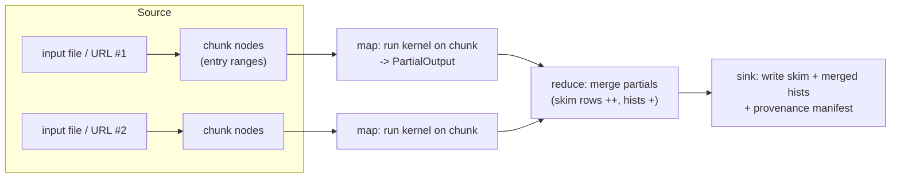

# Rust-native orchestration: the typed workflow DAG (design)

Phase 4. The LAW backend is **descoped** (`docs/vision.md`); the workflow layer
is in-language. This is the design the first `nano-workflow` slice implements.

## Why this layer exists

The typed kernel (`nano-analysis`) makes a *single event loop* correct. A real
analysis is many event loops over many files, with merges, systematic fan-out,
and outputs that must not go stale when an input changes. Those are
*workflow*-level invariants, and today they live in shell scripts and Condor
DAGs where they are unchecked. We lift them into a typed graph so the same
"make invalid states unrepresentable" discipline applies to the *schedule*, not
just the event.

What the workflow layer must guarantee (the error classes it removes):

- a **merge runs after** the maps it consumes — never before, never on a partial set;
- a **stale output is never silently reused** — if an input file, the spec, or
  the kernel changed, the artifact depending on it is recomputed;
- **provenance is recorded** — every artifact knows the inputs + code/spec
  version that produced it;
- **the schedule is sound by construction** — any order respecting the edges is
  legal, so serial and parallel runs are the same computation (this is the
  `nano-analysis` parallelism result, lifted to the graph).

## The graph

A workflow is a DAG of typed nodes; edges carry typed artifacts.



- **Source / chunk** — each input (local path or HTTPS URL) is split into
  bounded entry ranges via the existing `events_chunked` / `events_url_chunked`,
  so memory is bounded regardless of dataset size. One chunk → one map node.
- **Map** — runs the per-event kernel (the producer, or the generated one) over
  one chunk, yielding a `PartialOutput` (skim rows + partial `Hist1D`s + a
  cutflow). Map nodes are **independent** — the fan-out point.
- **Reduce** — merges partials associatively: rows concatenate, histograms and
  cutflows sum (a parallel-reduce, per `nano-analysis`). Systematics are a
  fan-out dimension here: one reduce per `Systematic`.
- **Sink** — writes the merged skim (`nano_io::write_events`) and histograms,
  plus a **provenance manifest**.

## Typed node states (the workflow typestate)

Each node moves through a small state machine, mirroring the event-level one:

```
Pending ──inputs ready──▶ Ready ──run──▶ Done(artifact)
   │                                          ▲
   └────────────── Stale ◀────────────────────┘  (input/param hash changed)
```

A `Reduce` node is simply *unconstructable* until its `Map` dependencies are
`Done` — the dependency is a typed value it consumes, so "merge before map" does
not compile, the same trick as `fill` requiring `Weighted<R>`.

## Provenance & staleness

Every artifact carries a **key** = hash of:

1. its input artifact keys (or, for sources, the file's content/size + a chunk
   descriptor),
2. the spec / `read_branches` it was produced under,
3. a kernel/code version stamp.

A node is **stale** if its recomputed key differs from the key recorded in the
manifest next to its output. Up-to-date nodes are **skipped** — re-running a
workflow after changing one file recomputes only the affected chunks and the
merges above them. Staleness is thus a *detectable, typed* condition, not a
"did someone remember to delete the cache?" guess. The manifest is plain JSON
(reproducible, diffable, no DB).

## The executor (where the parallelism proof pays off)

The DAG is just nodes + dependency edges; **any topological order is legal**.
So one verified graph runs under multiple executors with identical results:

- **serial** — one thread, for clarity / debugging;
- **rayon-parallel** — independent map nodes across cores; because `Event` is
  `Send + Sync` and the kernel has no shared mutable state, this is safe *by
  construction* — the borrow checker already proved it (see the parallelism
  note). Reduce is a parallel-reduce.

Serial vs parallel producing bit-identical output is an **assertion the
executor checks**, not a hope — the same discipline as the `bench_parallel`
demo, lifted to the workflow.

A later **submission target** (local thread pool now; a thin HTCondor/SLURM
mapper later) assigns independent map nodes to jobs. The target is swappable
*under* the DAG; the graph and its guarantees do not change. No LAW.

## How it connects to the rest

- **Input:** a validated `ResolvedPlan` (`nano-spec`) gives `read_branches` and
  (via codegen or a hand kernel) the per-event function; a dataset list gives
  the source files/URLs.
- **Output:** merged skim (`nano_io`) + histograms + the manifest. Eventually
  `nano run <spec> --inputs <list> [--systematics all]` builds and executes the
  DAG — the CLI/MCP "run" verb on top of the same compiler-gated action space.

## First implementable slice (`nano-workflow`)

Deliberately narrow, end-to-end, hermetic:

1. Artifacts: `ChunkSpec { source, entry_range }`, `PartialOutput { rows, hists,
   cutflow }`, `MergedOutput`.
2. A planner: inputs + `BranchSchema` + a kernel `Fn(&Event) -> Option<Row>`
   (+ optional hist fills) → source/map/reduce/sink nodes (chunks via
   `events_chunked`).
3. Executor with `serial` and `parallel` modes; **assert identical** merged
   output across the two (the proof, at workflow scale).
4. Provenance manifest (JSON) + staleness skip; **re-running is a no-op** when
   nothing changed, and touching one input recomputes only its sub-graph.
5. Sink writes the merged skim via `nano_io::write_events`.
6. Tests (hermetic): write a small ROOT file with `write_synthetic`, run the DAG
   over it serial vs parallel (identical), run twice (second run skips), and
   check the merged skim equals the single-pass `MuonProducer` result.

Deferred: systematic fan-out beyond one reduce-per-`Systematic`, the HTCondor
submission target, datacards/plots, and a graphical DAG view. Keep the typed
graph small and load-bearing — the guarantees (order, staleness, provenance,
sound parallel schedule), not a general workflow engine.
