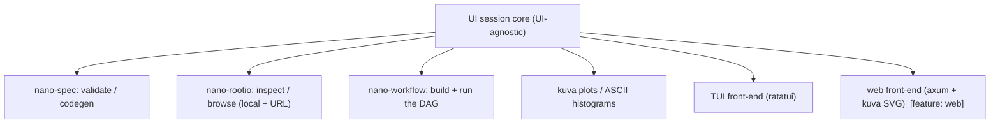

# Phase 7 — UI / visualization layer (design)

An **optional** human-facing layer over the workflow DAG: the human counterpart
to the MCP agent action space. It is **capability-gated** — the *same* core
session drives one of two front-ends depending on what's available:

- **kuva present** (built `--features web`) → a **web dashboard** + ROOT file
  browser, with live **kuva SVG** plots;
- **otherwise** → a **TUI** cockpit (ratatui), ASCII/sixel plots.

Same data, same operations, same DAG underneath — only the rendering differs. It
sits above Phase 4 (the workflow DAG) and reuses the Phase 3/5 ops; it adds no
weight to the core (separate optional crate, off by default).

## Why capability-gated

kuva renders **SVG/PNG**, which is native to a browser and awkward in a plain
terminal. So:

- if you have kuva (and a browser), the **web dashboard** is the right medium —
  embed the SVG plots live, zoomable, alongside a ROOT file browser and the DAG
  view;
- if you don't, fall back to the **TUI** — fully in-terminal, plots as the ASCII
  histograms we already produce (or sixel on kitty/iTerm).

No second-class experience: both are first-class views of the same session; the
TUI is the always-available baseline, the web dashboard the richer option.

## Architecture: one core, two front-ends

The **session core** is UI-agnostic: open a spec → validate → derive
read_branches → (codegen) → build the workflow DAG → run it → collect outputs +
plot data. Both front-ends call this core; neither contains physics or I/O logic.

## The DAG is the centerpiece

This layer is built *around* the workflow DAG (that's the "with a DAG" part):

- **show the graph** — source → map → reduce → sink nodes and their edges;
- **run it** and watch node states live (Pending → Running → Done; **stale**
  nodes highlighted via the provenance manifest);
- **inspect outputs** — the merged skim summary, cutflow, and the mass
  histogram(s);
- so the GUI is the *human view of the same DAG* the MCP server exposes to agents
  — propose/inspect/run, with the compiler/validator still the gate.

## What each front-end shows (first slice)

**TUI (default, ratatui):**
- a **ROOT file browser** — open a local path or URL, list trees + branch
  names/types (reuses `nano inspect`);
- a spec pane — pick a spec, validate (errors shown inline), view derived
  read_branches and the generated kernel;
- run the muon/workflow DAG with a live cutflow + an ASCII mass histogram.

**Web dashboard (`--features web`, axum + kuva):**
- the same ROOT browser, spec view, and run;
- but plots are **kuva SVG** embedded live (dimuon spectrum, Higgs peak/stack),
  zoomable; spec editing in a textarea with inline validation.

## Phasing

- **7a** — `nano-ui` crate: the session core + a **TUI** with the ROOT file
  browser, spec validate/codegen view, and run-the-DAG with live cutflow +
  ASCII plot. (No new heavy deps beyond ratatui.)
- **7b** — `--features web`: the **axum dashboard** serving the same core +
  embedded **kuva SVG** plots and a spec editor.
- **7c** — a live **DAG graph view** (node states, staleness) in both
  front-ends; richer ROOT browsing (open histograms/branches as plots).

Deliberately deferred: editing/writing ROOT files from the UI, multi-run
comparison, and any auth/remote-serving of the dashboard (it's a *local* tool).
Keep it a thin, optional cockpit over the verified core — never a place where
physics logic hides.
